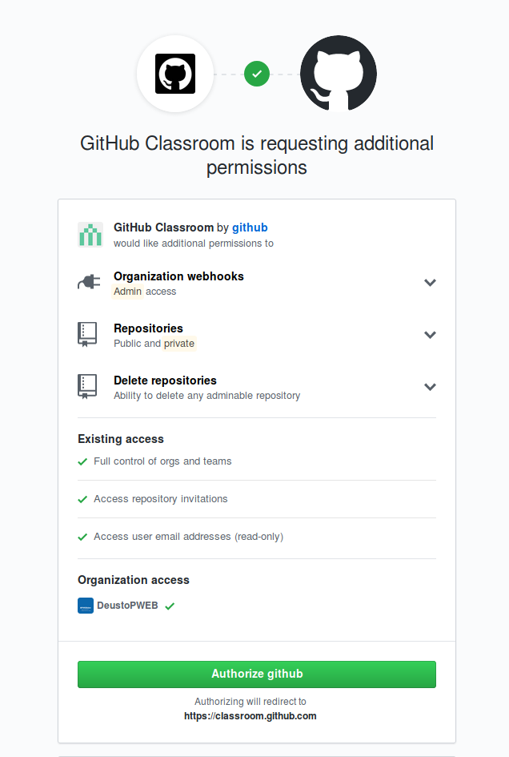
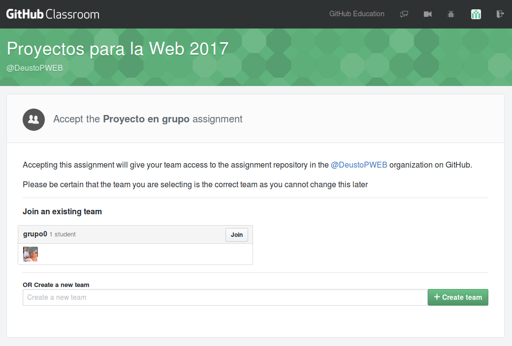
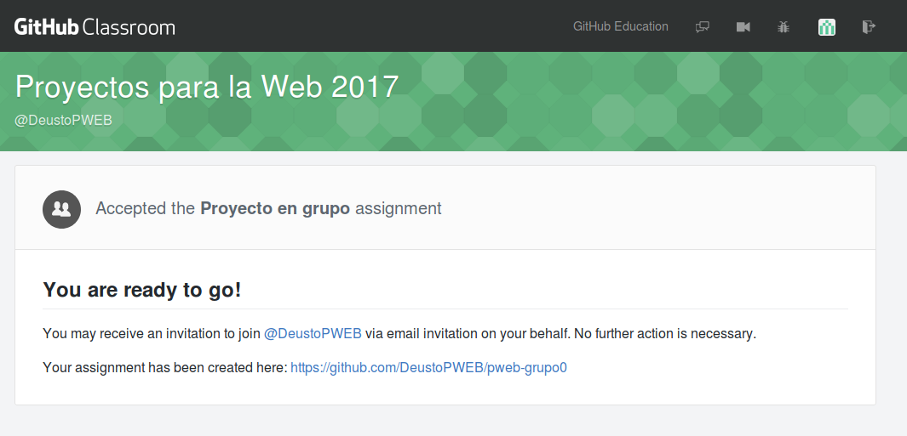

# Cómo iniciar vuestro repositorio de grupo

Vais a crear un repositorio compartido para cada grupo, donde iréis realizando el trabajo del proyecto web de esta asignatura. Ese repositorio, además, se iniciará con un _contenido base_ (el que está contenido en el repositorio [plantilla-proyecto-web](https://github.com/DeustoPWEB/plantilla-proyecto-web) sobre el que iréis generando el vuestro propio.

Seguid estos pasos para iniciar este trabajo:

1. Accede a ~~[este enlace](https://classroom.github.com/g/er5wswCQ)~~ [este enlace nuevo](https://classroom.github.com/g/rpt5aBbw)
2. Es posible que tengas que autorizar a GitHub Classroom para que pueda acceder a tu cuenta. Asegúrate de que "DeustoPWEB" está activado en la sección **Organization access** y haz clic en el botón **Authorize github**

 

:exclamation::exclamation: **A partir de aquí es MUY importante que hagas correctamente la selección del grupo, porque es muy complejo hacer cambios después**

3. Si tu grupo aparece en la sección **Join an existing team**, haz clic en el botón **Join** del grupo correspondiente

  

4. Si tu grupo NO aparece en la sección **Join an existing team**, tendrás que escribir tu número de grupo en el campo **OR Create a new team** justo debajo
    - Escribe `grupo0`, sustituyendo `0` por tu número de grupo
    - Haz clic en el botón **+ Create team**
5. Ya está :clap: Verás la pantalla **You are ready to go!**, con un link a tu repositorio de grupo

  

:sparkles: Ese repositorio recién creado es donde haréis todo el trabajo relacionado con el proyecto en grupo de la asignatura :sparkles:
